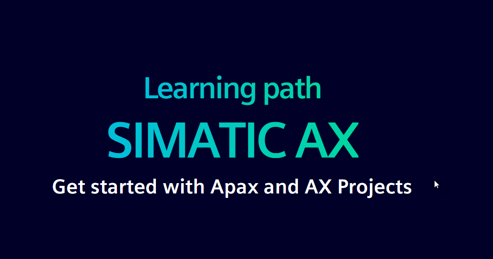

# Get started with Apax and AX Projects

[](https://simatic-ax.github.io/axlp_apax_and_project_creation/#/)

## Objective
This repository provides a learning path for getting started with Apax and AX Projects. It includes a presentation that covers the basics of package management, using Apax, building projects, and more.

## Start the presentation

To start the presentation, please click on the link below:

[Get started with Apax and AX Projects](https://simatic-ax.github.io/axlp_apax_and_project_creation/#/)

## Summary of Presentation Slides

## Prerequisites

Before you can view the presentation locally, you need to have `reveal-md` installed. Ensure you have Node.js and npm installed on your machine.

### Install Node.js and npm

Download and install Node.js from the [official website](https://nodejs.org/). npm is included with Node.js.

### Install reveal-md

Once Node.js and npm are installed, you can install `reveal-md` globally using the following command:

```sh
npm install -g reveal-md
```

The `slides.md` file contains the content for the presentation. To view the presentation locally, use the command:

```
reveal-md slides.md --watch --theme theme/simatic-ax.css -css theme/simatic-ax.css
```
To generate a static version of the presentation for GitHub Pages, use the command:

```
reveal-md slides.md --static docs --theme theme/simatic-ax.css -css theme/simatic-ax.css --assets-dir dist --staticDirs img 
```
The static files will be generated in the `docs` directory, which can be used to host the presentation on GitHub Pages.

## Contribution

Thanks for your interest in contributing. Anybody is free to report bugs, unclear documentation, and other problems regarding this repository in the Issues section or, even better, is free to propose any changes to this repository using Merge Requests.

## License and Legal information

Please read the [Legal information](LICENSE.md)